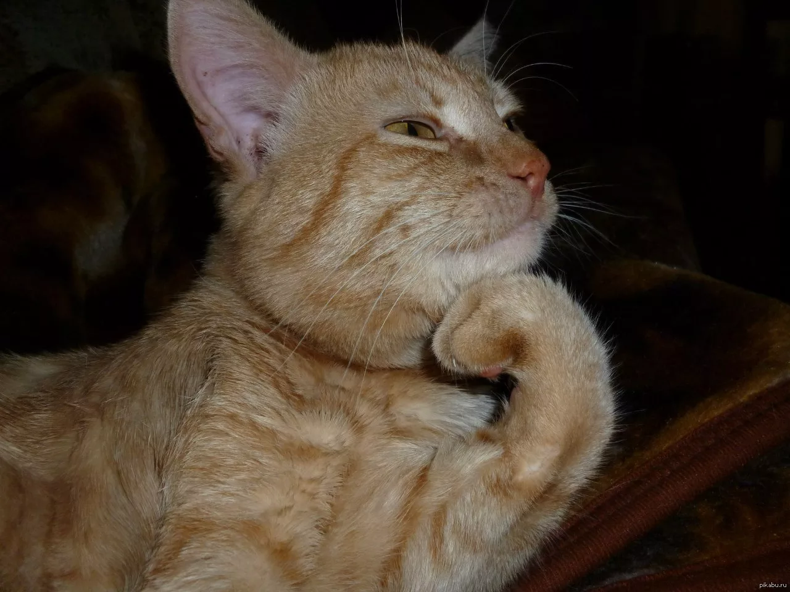
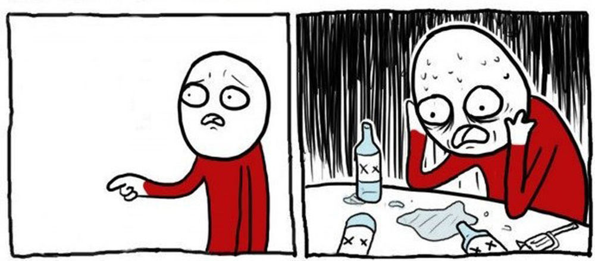
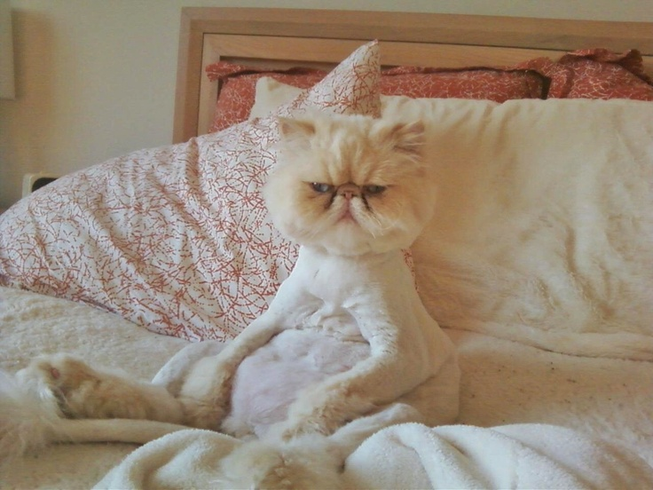

<!DOCTYPE html>
<html lang="ru">
<head>
    <meta charset="UTF-8">
    <meta name="viewport" content="width=device-width, initial-scale=1.0">
    <title>Мемополис - Лучшие мемы интернета</title>
    <link rel="stylesheet" href="css.css">
    <link rel="preconnect" href="https://fonts.googleapis.com">
    <link rel="preconnect" href="https://fonts.gstatic.com" crossorigin>
    <link href="https://fonts.googleapis.com/css2?family=Comic+Neue:wght@400;700&family=Roboto:wght@300;400;700&display=swap" rel="stylesheet">
</head>
<body>
    <header class="header">
        

            

                <a href="1.html" class="logo">Мемополис</a>
                <nav class="nav">
                    <a href="1.html" class="nav__link">Главная</a>
                    <a href="category.html" class="nav__link">Категории</a>
                    <a href="infa.html" class="nav__link">О нас</a>
                    <a href="contacts.html" class="nav__link">Контакты</a>
                </nav>
            

        

    </header>
    <main class="main">
        

            <h1 class="main__title">Шутки, шуточки, шутейки</h1>
            
Смех продлевает жизнь! Делитесь любимыми мемами с друзьями

            

                <!-- Мем 1 -->
                

                    
                    

                        <h2 class="meme-title">Кот-философ</h2>
                        
Когда ты понял, что жизнь сложнее, чем казалось...

                        <a href="meme1.html" class="meme-link">Подробнее</a>
                    

                

                <!-- Мем 2 -->
                

                    
                    

                        <h2 class="meme-title">Программист и баги</h2>
                        
Когда находишь баг в 3 утра и понимаешь, что сам его создал...

                        <a href="meme2.html" class="meme-link">Подробнее</a>
                    

                

                <!-- Мем 3 -->
                

                    
                    

                        <h2 class="meme-title">Утро понедельника</h2>
                        
Все мы немножко котики в понедельник утром...

                        <a href="meme3.html" class="meme-link">Подробнее</a>
                    

                

            

        

    </main>
    <footer class="footer">
        

            

                
© 2024 Мемополис. Все права защищены.

                

                    <a href="#" class="social-link">VK</a>
                    <a href="#" class="social-link">Telegram</a>
                    <a href="#" class="social-link">Instagram</a>
		    
Бурда Евгения Григорьевна - я люблю вас!!

                

            

        

    </footer>
</body>
</html>
